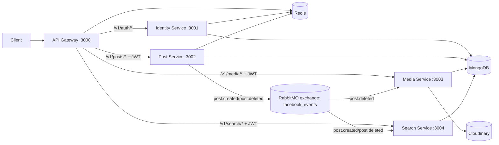

# Social Media Backend (Node.js Microservices)

## 1) Project Overview

This repository implements a social-media backend using a microservices architecture in Node.js. It is built to explore practical service decomposition, API gateway routing, event-driven communication, and independent service concerns (identity, posts, media, and search).

### Purpose

The system solves a common backend challenge: handling user auth, post management, media storage, and search in a way that can scale and evolve independently.

### Microservices Approach Used Here

- **Edge routing via API Gateway** for a single public entrypoint (`/v1/*`).
- **Service-level ownership** of domain logic:
  - identity/auth
  - posts
  - media
  - search/indexing
- **Async event-driven integration** through RabbitMQ (`post.created`, `post.deleted`) for eventual consistency between services.
- **Independent data models per service** (MongoDB collections per service domain).

---

## 2) Architecture Overview

### High-level Design

- Clients call the **API Gateway**.
- Gateway validates JWT for protected routes and forwards requests to internal services.
- `post-service` publishes domain events to RabbitMQ.
- `media-service` and `search-service` consume events to update derived state.
- Redis is used for rate limiting (gateway/identity) and response caching (post service).

### Architecture Diagram



### Communication Style

- **Synchronous**: HTTP REST-like APIs via gateway proxy.
- **Asynchronous**: RabbitMQ topic exchange for post lifecycle events.
- **Gateway as trust boundary**: downstream services use `x-user-id` from gateway instead of verifying JWT themselves.

---

## 3) Services Breakdown

| Service | Responsibility | Key Endpoints | Dependencies |
|---|---|---|---|
| `api-gateway` | Public entrypoint, JWT validation, proxy routing, security middleware | `/v1/auth/*`, `/v1/posts/*`, `/v1/media/*`, `/v1/search/*` | Redis, JWT, downstream service URLs |
| `identity-service` | User register/login/logout/token refresh, password hashing, refresh token lifecycle | `POST /api/auth/register`, `POST /api/auth/login`, `POST /api/auth/refreshToken`, `POST /api/auth/logout` | MongoDB, Redis, Argon2, JWT |
| `post-service` | Create/list/get/delete posts, cache read results, emit post events | `POST /api/posts/create-post`, `POST /api/posts/posts`, `POST /api/posts/:id`, `DELETE /api/posts/:id` | MongoDB, Redis, RabbitMQ |
| `media-service` | Upload media, persist metadata, delete media when post deleted | `POST /api/media/upload`, `GET /api/media/get` | MongoDB, Cloudinary, RabbitMQ |
| `search-service` | Full-text search over post content, projection maintenance via events | `GET /api/search/posts?query=...` | MongoDB, RabbitMQ |

---

## 4) Tech Stack

### Runtime / Frameworks

- Node.js (CommonJS modules)
- Express 5 (`express@5.x`) across all services

### Data / Messaging / Caching

- MongoDB + Mongoose (all domain services)
- RabbitMQ (`amqplib`) for events
- Redis (`ioredis`) for rate limiting and caching

### Security / Validation / Utilities

- `jsonwebtoken` for access tokens
- `argon2` for password hashing (identity)
- `joi` for input validation (identity/post)
- `helmet`, `cors`, `express-rate-limit`
- `winston` logging

### Media

- Cloudinary (`cloudinary` package) in media service
- Multer for multipart upload handling

### Containerization

- Dockerfiles per service (Node 18 Alpine)
- Root `docker-compose.yml`

---

## 5) Project Structure

This repository is organized as a **single repository with separate service folders** (monorepo-style layout, not npm workspaces).

```text
social-media-backend/
  api-gateway/
    src/
      middleware/
      utils/
      server.js
  identity-service/
    src/
      controllers/
      models/
      routes/
      utils/
      server.js
  post-service/
    src/
      controllers/
      middleware/
      models/
      routes/
      utils/
      server.js
  media-service/
    src/
      controllers/
      eventHandlers/
      middleware/
      models/
      routes/
      utils/
      server.js
  search-service/
    src/
      controllers/
      eventHandlers/
      middleware/
      models/
      routes/
      utils/
      server.js
  docker-compose.yml
```

---

## 6) Setup & Installation

### Prerequisites

- Node.js 18+
- npm 9+
- MongoDB instance (local or hosted)
- Redis
- RabbitMQ
- Cloudinary account (for media uploads)
- Docker + Docker Compose (optional, recommended for local orchestration)

### Step-by-step Setup

1. Clone the repository.
2. Install dependencies per service:

```bash
cd api-gateway && npm install
cd ../identity-service && npm install
cd ../post-service && npm install
cd ../media-service && npm install
cd ../search-service && npm install
```

3. Create `.env` in each service directory (see configuration tables below).
4. Start required infrastructure (MongoDB, Redis, RabbitMQ).
5. Run services individually or via Docker Compose.

---

## 7) Running the System

### Option A: Run all services with Docker Compose

From repository root:

```bash
docker compose up --build
```

Notes:
- Compose starts all Node services, Redis, and RabbitMQ.
- MongoDB is **not defined** in current `docker-compose.yml`; point `MONGODB_URI` to an external/local MongoDB.

### Option B: Run services individually (local dev)

In separate terminals:

```bash
cd api-gateway && npm run dev
cd identity-service && npm run dev
cd post-service && npm run dev
cd media-service && npm run dev
cd search-service && npm run dev
```

Production mode per service:

```bash
npm start
```

---

## 8) Service Communication Flow

### Typical Request Flow (Create Post)

1. Client calls `POST /v1/posts/create-post` with `Authorization: Bearer <access_token>`.
2. Gateway validates JWT and injects `x-user-id`.
3. Gateway proxies request to `post-service` (`/api/posts/create-post`).
4. Post is saved in MongoDB and read caches are invalidated in Redis.
5. `post-service` publishes `post.created` to RabbitMQ exchange `facebook_events`.
6. `search-service` consumes event and upserts searchable projection.
7. Response returns through gateway to client.

### Typical Request Flow (Delete Post)

1. Client calls `DELETE /v1/posts/:id`.
2. `post-service` deletes owned post and publishes `post.deleted`.
3. `media-service` consumes `post.deleted`, removes Cloudinary assets and media records.
4. `search-service` consumes `post.deleted` and removes indexed search record.

---

## 9) API Documentation

> Public base URL is gateway: `http://localhost:3000/v1`

### Auth APIs

#### Register

```http
POST /v1/auth/register
Content-Type: application/json

{
  "userName": "alice",
  "email": "alice@example.com",
  "password": "StrongPass123"
}
```

Example response:

```json
{
  "success": true,
  "message": "User registered successfully",
  "accessToken": "<jwt>",
  "refreshToken": "<token>"
}
```

#### Login

```http
POST /v1/auth/login
Content-Type: application/json

{
  "email": "alice@example.com",
  "password": "StrongPass123"
}
```

Example response:

```json
{
  "accessToken": "<jwt>",
  "refreshToken": "<token>",
  "userId": "<mongo_object_id>"
}
```

#### Refresh / Logout

- `POST /v1/auth/refreshToken` with `{ "refreshToken": "<token>" }`
- `POST /v1/auth/logout` with `{ "refreshToken": "<token>" }`

### Post APIs (JWT required)

#### Create Post

```http
POST /v1/posts/create-post
Authorization: Bearer <access_token>
Content-Type: application/json

{
  "content": "My first post",
  "mediaIds": ["<media_id_optional>"]
}
```

#### List Posts (paginated)

```http
POST /v1/posts/posts?page=1&limit=10
Authorization: Bearer <access_token>
```

#### Get Post by Id

```http
POST /v1/posts/<post_id>
Authorization: Bearer <access_token>
```

#### Delete Post

```http
DELETE /v1/posts/<post_id>
Authorization: Bearer <access_token>
```

### Media APIs (JWT required)

#### Upload Media

```http
POST /v1/media/upload
Authorization: Bearer <access_token>
Content-Type: multipart/form-data

file: <binary>
```

Example response:

```json
{
  "success": true,
  "mediaId": "<media_id>",
  "url": "https://res.cloudinary.com/...",
  "message": "Media upload is successfull"
}
```

#### List Media

```http
GET /v1/media/get
Authorization: Bearer <access_token>
```

### Search APIs (JWT required)

```http
GET /v1/search/posts?query=hello
Authorization: Bearer <access_token>
```

Example response:

```json
{
  "results": [
    {
      "postId": "<post_id>",
      "userId": "<user_id>",
      "content": "hello world",
      "createdAt": "2026-01-01T00:00:00.000Z"
    }
  ]
}
```

---

## 10) Configuration

### Ports

| Service | Default Port | Publicly Exposed in Compose |
|---|---:|---|
| `api-gateway` | 3000 | Yes (`3000:3000`) |
| `identity-service` | 3001 | No |
| `post-service` | 3002 | No |
| `media-service` | 3003 | No |
| `search-service` | 3004 | No |
| `redis` | 6379 | Yes (`6379:6379`) |
| `rabbitmq` | 5672 | Yes (`5672:5672`, mgmt `15672:15672`) |

### Environment Variables by Service

#### `api-gateway/.env`

| Variable | Required | Description |
|---|---|---|
| `PORT` | No | Gateway port (default `3000`) |
| `REDIS_URL` | Yes | Redis connection string |
| `IDENTITY_SERVICE_URL` | Yes | Internal identity URL (e.g. `http://identity-service:3001`) |
| `POST_SERVICE_URL` | Yes | Internal post URL |
| `MEDIA_SERVICE_URL` | Yes | Internal media URL |
| `SEARCH_SERVICE_URL` | Yes | Internal search URL |
| `JWT_SECRET` | Yes | JWT verification secret |
| `NODE_ENV` | No | Runtime environment |

#### `identity-service/.env`

| Variable | Required | Description |
|---|---|---|
| `PORT` | No | Service port (default `3001`) |
| `MONGODB_URI` | Yes | MongoDB connection string |
| `REDIS_URL` | Yes | Redis connection string |
| `JWT_SECRET` | Yes | JWT signing secret |
| `NODE_ENV` | No | Runtime environment |

#### `post-service/.env`

| Variable | Required | Description |
|---|---|---|
| `PORT` | No | Service port (default `3002`) |
| `MONGODB_URI` | Yes | MongoDB connection string |
| `REDIS_URL` | Yes | Redis connection string |
| `RABBITMQ_URL` | Yes | RabbitMQ connection string |
| `NODE_ENV` | No | Runtime environment |

#### `media-service/.env`

| Variable | Required | Description |
|---|---|---|
| `PORT` | No | Service port (default `3003`) |
| `MONGODB_URI` | Yes | MongoDB connection string |
| `RABBITMQ_URL` | Yes | RabbitMQ connection string |
| `cloud_name` | Yes | Cloudinary cloud name |
| `api_key` | Yes | Cloudinary API key |
| `api_secret` | Yes | Cloudinary API secret |
| `NODE_ENV` | No | Runtime environment |

#### `search-service/.env`

| Variable | Required | Description |
|---|---|---|
| `PORT` | No | Service port (default `3004`) |
| `MONGODB_URI` | Yes | MongoDB connection string |
| `RABBITMQ_URL` | Yes | RabbitMQ connection string |
| `NODE_ENV` | No | Runtime environment |

> Note: `docker-compose.yml` injects `REDIS_URL` and `RABBITMQ_URL` for services at runtime; each service also references its local `.env`.

---

## 11) Testing

Current state:

- No implemented automated tests were found.
- Each service has a placeholder test script:

```bash
npm test
# -> "Error: no test specified"
```

Suggested testing stack:
- Unit: Jest
- Integration: Supertest + test containers (MongoDB/Redis/RabbitMQ)
- Contract/event tests for RabbitMQ payloads

---

## 12) Deployment

### Current Deployment Readiness

- Containerized services with per-service Dockerfiles.
- Compose orchestration for local/dev environments.

### Recommended Production Deployment Pattern

- Deploy gateway and each service as separate containers/tasks (Kubernetes, ECS, or similar).
- Use managed services:
  - MongoDB Atlas (or managed MongoDB)
  - Managed Redis
  - Managed RabbitMQ
  - Cloudinary
- Put gateway behind a load balancer and TLS termination.
- Add centralized observability (logs, metrics, tracing).

---

## 13) Learning Outcomes Demonstrated

This project demonstrates:

- **Service isolation**: business domains split into independent deployable services.
- **Inter-service communication**:
  - Sync request/response via gateway proxy
  - Async event propagation via RabbitMQ topics
- **Scalability fundamentals**: each service can scale independently by load profile.
- **Event-driven consistency**: search/media updated from post lifecycle events.
- **Resilience basics**: rate limiting and reduced coupling through async consumers.

---

## 14) Future Improvements

Based on current implementation, high-impact improvements are:

1. Add automated tests (unit, integration, event contract).
2. Add MongoDB service to `docker-compose.yml` for full local bootstrapping.
3. Harden auth model:
   - verify JWT in internal services (or enforce strict network isolation + mTLS).
4. Improve API conventions (`POST /posts/posts` and `POST /posts/:id` are non-standard).
5. Make RabbitMQ durable (durable exchange/queues, retry/dead-letter policies).
6. Add API documentation standard (OpenAPI/Swagger).
7. Add observability and health checks (`/health`, `/ready`, structured metrics).
8. Fix search delete handler filter (`findOneAndDelete` currently receives raw id value).

---

## Assumptions & Notes

- This README is based on the current code behavior in each service.
- If local `.env` values differ, runtime behavior may differ.
- No assumptions were made about hidden infrastructure outside this repo except where required by missing compose services (MongoDB, Cloudinary account).

